OOP Patterns
============

Примеры на ruby из книги Приемы объектно-ориентированного проектирования.

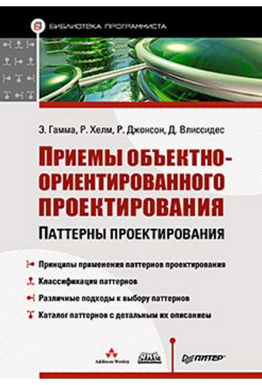

### Creational - Пораждающие паттерны 
* [Abstract Factory(Абстрактная фабрика)](#af)
* [Builder(Строитель)](#bui)
* [Factory Method(Фабричный метод)](#fm)
* [Prototype(Прототип)](#pt)
* [Singleton(Одиночка)](#sng)

### Structural - Структурные паттерны
+ [Adapter(Адаптер)](#ad)
+ [Bridge(Мост)](#br)
+ [Composite(Компоновщик)](#cm)
+ [Decorator(Декоратор)](#dc)
+ [Facade(Фасад)](#fc)
+ [Flyweight(Приспособленец)](#fl)
+ [Proxy(Заместитель)](#pr)

### Behaviors - Патерны поведения
- [Chain of Responsibility(Цепочка обязанностей)](#ch)
- [Command(Комманда)](#cmd)
- [Interpreter(Интерпретатор)](#int)
- [Iterator(Итератор)](#it)
- [Mediator(Посредник)](#md)
- [Memento(Хранитель)](#mem)
- [Observer(Наблюдатель)](#obs)
- [State(Состояние)](#st)
- [Strategy(Стратегия)](#str)
- [Template Method(Шаблонный метод)](#tm)
- [Visitor(Посетитель)](#vs)

Creational - Пораждающие паттерны 
----------------------------

### <a name="af">_Abstract Factory(Абстрактная фабрика), Kit(инструментарий)_</a> 
#### Назначение
Предоставляет интерфейс для создания семейств взаимосвязанных или взаимозависимых объектов, не специфицируя их конкретных классов.
#### Структура
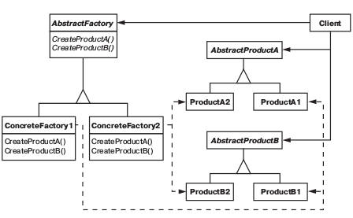
#### Применимость
* система не должна зависеть от того, как создаются, компонуются и представляются входящие в нее объекты;
* входящие в семейство взаимосвязанные объекты должны использоваться вместе и вам необходимо обеспечить выполнение этого ограничения;
* система должна конфигурироваться одним из семейств составляющих её объектов;
* вы хотите предоставить библиотеку объектов, раскрывая только их интерфейсы, но не реализацию.

### _Builder(Строитель)_
#### Назначение
Отделяет конструирование сложного объекта от его представления, так что в результате одного и того же процесса
конструирования могут получаться разные представления.
#### Структура
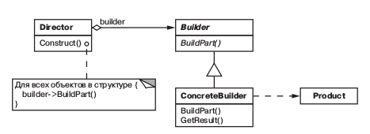
#### Применимость
* Алгоритм создания сложного объекта не должен зависеть от того, из каких частей состоит объект и как они стыкуются между собой; 
* процесс конструирования должен обеспечивать различные представления
  конструируемого объекта.
    
### <a name="fm">_Factory Method(Фабричный метод)_</a>
#### Назначение
Определяет интерфейс для создания объекта, но оставляет подклассам решение о том, какой класс инстанцировать.
 Фабричный метод позволяет классу делегировать инстанцирование подклассам.
#### Структура
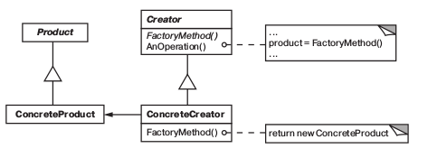
#### Применимость
* классу заранее неизвестно, объекты каких классов ему нужно создавать;
* класс спроектирован так, чтобы объекты, которые он создает, специфицировались подклассами;
* класс делегирует свои обязанности одному из нескольких вспомогательных подклассов, и вы планируете локализовать 
знание о том, какой класс принимает эти обязанности на себя.

### <a name="pt">_Prototype(Прототип)_</a>
#### Назначение
Задает виды создаваемых объектов с помощью экземпляра прототипа и создает новые объекты путем копирования этого прототипа.
  Используйте паттерн прототип, когда система не должна зависеть от того, как
  в ней создаются, компонуются и представляются продукты:
#### Структура
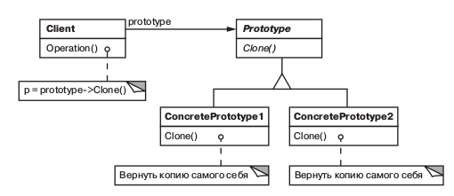
#### Применимость
* инстанцируемые классы определяются во время выполнения, например с помощью динамической загрузки;
* для того чтобы избежать построения иерархий классов или фабрик, параллельных иерархии классов продуктов;
* экземпляры класса могут находиться в одном из не очень большого числаразличных состояний.
 Может оказаться удобнее установить соответствующее число прототипов и клонировать их, а не инстанцировать каждый раз
 класс вручную в подходящем состоянии.   

### <a name="sng">_Singleton(Одиночка)_</a>
#### Назначение
Гарантирует, что у класса есть только один экземпляр, и предоставляет к нему глобальную точку доступа.
#### Структура
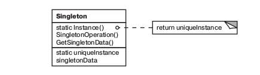
#### Применимость
*  должен быть ровно один экземпляр некоторого класса, легко доступный всем клиентам;
* единственный экземпляр должен расширяться путем порождения подклассов, и клиентам нужно иметь возможность работать
 с расширенным экземпляром без модификации своего кода.

Structural - Структурные паттерны
----------------------------
 
### <a name="ad">_Adapter(Адаптер)_</a>
#### Назначение
Преобразует интерфейс одного класса в интерфейс другого, который ожидают клиенты.
 Адаптер обеспечивает совместную работу классов с несовместимыми интерфейсами, которая без него была бы невозможна.
#### Структура
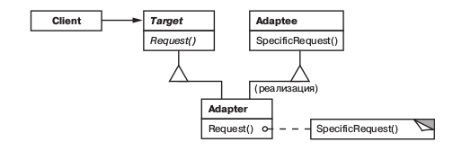   
#### Применимость
* хотите использовать существующий класс, но его интерфейс не соответствует вашим потребностям;
* собираетесь создать повторно используемый класс, который должен взаимодействовать с заранее неизвестными или не связанными с ним классами,
  имеющими несовместимые интерфейсы;
* (только для адаптера объектов!) нужно использовать несколько существующих подклассов, но непрактично адаптировать их интерфейсы путем 
порождения новых подклассов от каждого. В этом случае адаптер объектов может приспосабливать интерфейс их общего родительского класса.  
     
### <a name="br">_Bridge(Мост)_</a>
#### Назначение
Отделить абстракцию от ее реализации так, чтобы то и другое можно было
  изменять независимо.
#### Структура
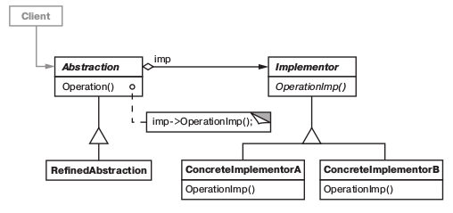
#### Применимость
* хотите избежать постоянной привязки абстракции к реализации. Так, например, бывает, когда реализацию необходимо 
выбирать во время выполнения программы;
* и абстракции, и реализации должны расширяться новыми подклассами.В таком случае паттерн мост позволяет комбинировать
 разные абстракции и реализации и изменять их независимо;
* изменения в реализации абстракции не должны сказываться на клиентах, то есть клиентский код не должен перекомпилироваться;

### <a name="cm">_Composite(Компоновщик)_</a>
#### Назначение
Компонует объекты в древовидные структуры для представления иерархий
часть целое. Позволяет клиентам единообразно трактовать индивидуальные и составные объекты.
#### Структура
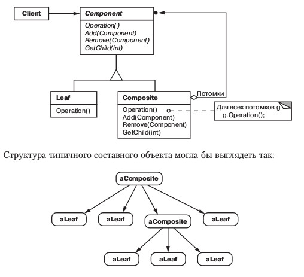
#### Применимость
* нужно представить иерархию объектов вида часть целое;
* хотите, чтобы клиенты единообразно трактовали составные и индивидуальные объекты.

### <a name="dc">_Decorator(Декоратор)_</a>
#### Назначение
Динамически добавляет объекту новые обязанности. Является гибкой альтернативой порождению подклассов с целью расширения функциональности.
#### Структура
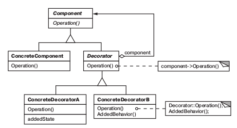
#### Применимость
* для динамического, прозрачного для клиентов добавления обязанностей объектам;
* для реализации обязанностей, которые могут быть сняты с объекта;
* когда расширение путем порождения подклассов по каким то причинам неудобно или невозможно.
  Иногда приходится реализовывать много независимых расширений, так что порождение подклассов для поддержки всех возможных 
  комбинаций приведет к комбинаторному росту их числа. В других случаях определение класса может быть скрыто или почему
  либо еще недоступно, так что породить от него подкласс нельзя.          
  
### <a name="fc">_Facade(Фасад)_</a>
#### Назначение
Предоставляет унифицированный интерфейс вместо набора интерфейсов некоторой подсистемы. Фасад определяет интерфейс
 более высокого уровня, который упрощает использование подсистемы.
#### Структура
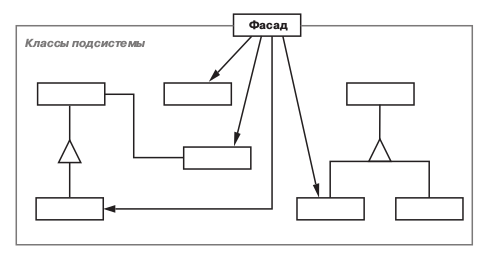   
#### Применимость
* хотите предоставить простой интерфейс к сложной подсистеме. Часто подсистемы усложняются по мере развития. 
  Применение большинства паттернов приводит к появлению меньших классов, но в большем количестве.
  Такую подсистему проще повторно использовать и настраивать под конкретные нужды, но вместе с тем применять подсистему
  без настройки становится труднее. Фасад предлагает некоторый вид системы по умолчанию, устраивающий большинство клиентов.
  И лишь те объекты, которым нужны более широкие возможности настройки, могут обратиться напрямую к тому, что находится за фасадом;
* между клиентами и классами реализации абстракции существует много зависимостей.
  Фасад позволит отделить подсистему как от клиентов, так и от других подсистем, что, в свою очередь,
  способствует повышению степени независимости и переносимости;
* вы хотите разложить подсистему на отдельные слои. Используйте фасад для определения точки входа
  на каждый уровень подсистемы. Если подсистемы зависят друг от друга, то зависимость можно упростить,
  разрешив подсистемам обмениваться информацией только через фасады.     
  
### <a name="fl">_Flyweight(Приспособленец)_</a>  
#### Назначение
Использует разделение для эффективной поддержки множества мелких объектов.
#### Структура
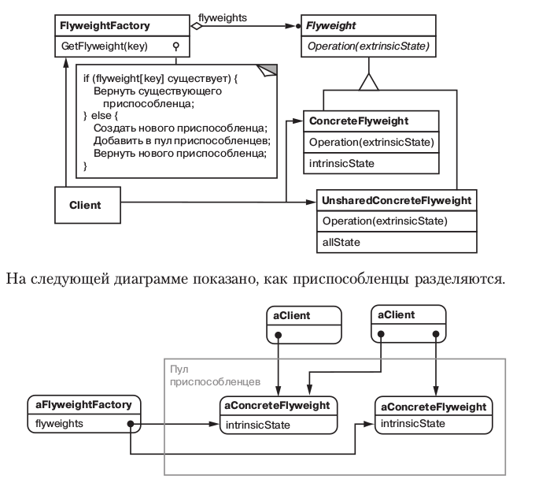  
#### Применимость
* в приложении используется большое число объектов;
* из-за этого накладные расходы на хранение высоки;
* большую часть состояния объектов можно вынести вовне;
* многие группы объектов можно заменить относительно небольшим количеством разделяемых объектов, поскольку внешнее состояние вынесено;
* приложение не зависит от идентичности объекта. Поскольку объекты при способленцы могут разделяться, то проверка на идентичность возвратит
  «истину» для концептуально различных объектов
  
### <a name="pr">_Proxy(Заместитель)_</a>
#### Назначение
Является суррогатом другого объекта и контролирует доступ к нему.
#### Структура
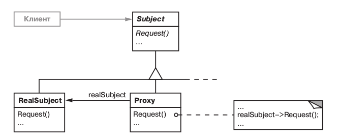  
#### Применимость
* виртуальный заместитель создает «тяжелые» объекты по требованию.
* защищающий заместитель контролирует доступ к исходному объекту. Такие заместители полезны, когда для разных
 объектов определены различные права доступа
* «умная» ссылка – это замена обычного указателя. Она позволяет выполнить
   дополнительные действия при доступе к объекту. К типичным применениям такой ссылки можно отнести:
* подсчет числа ссылок на реальный объект, с тем чтобы занимаемую им память можно было освободить автоматически,
когда не останется ни одной ссылки (такие ссылки называют еще «умными» указателями );
* загрузку объекта в память при первом обращении к нему;
* проверку и установку блокировки на реальный объект при обращении к нему, чтобы никакой другой объект не смог
в это время изменить его

Behaviors - Патерны поведения
----------------------------

### <a name="ch">_Chain of Responsibility(Цепочка обязанностей)_</a>
#### Назначение
Позволяет избежать привязки отправителя запроса к его получателю, давая шанс обработать запрос нескольким объектам.
 Связывает объекты получатели в цепочку и передает запрос вдоль этой цепочки, пока его не обработают.
#### Структура
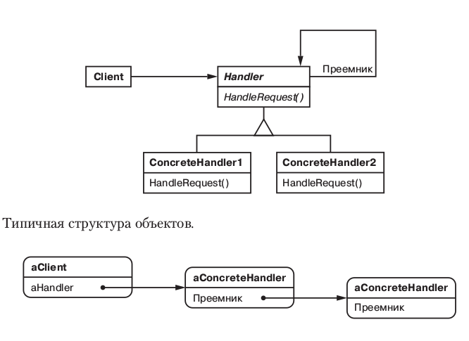
#### Применимость
* есть более одного объекта, способного обработать запрос, причем настоящий обработчик заранее неизвестен и должен быть найден автоматически;
* вы хотите отправить запрос одному из нескольких объектов, не указывая явно, какому именно;
* набор объектов, способных обработать запрос, должен задаваться динамически.

### <a name="cmd">_Command(Комманда)_</a>
#### Назначение
Инкапсулирует запрос как объект, позволяя тем самым задавать параметры клиентов для обработки соответствующих запросов,
 ставить запросы в очередь или протоколировать их, а также поддерживать отмену операций.
#### Структура
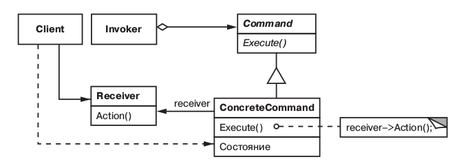
#### Применимость
* параметризовать объекты выполняемым действием, как в случае с пунктами меню MenuItem. В процедурном языке такую параметризацию можно
  выразить с помощью функции обратного вызова, то есть такой функции, которая регистрируется, чтобы быть вызванной позднее.
  Команды представляют собой объектно ориентированную альтернативу функциям обратного вызова; 
* определять, ставить в очередь и выполнять запросы в разное время. Время жизни объекта Command необязательно должно зависеть от времени жизни
  исходного запроса. Если получателя запроса удается реализовать так, что бы он не зависел от адресного пространства, 
  то объект команду можно передать другому процессу, который займется его выполнением;
* поддержать отмену операций. Операция Execute объекта Command может
  сохранить состояние, необходимое для отката действий, выполненных командой. В этом случае в интерфейсе класса Command должна 
  быть дополнительная операция Unexecute, которая отменяет действия, выполненные предшествующим обращением к Execute. 
  Выполненные команды хранятся в списке истории. Для реализации произвольного числа уровней отмены
  и повтора команд нужно обходить этот список соответственно в обратноми прямом направлениях, вызывая при посещении
  каждого элемента команду Unexecute или Execute;
* поддержать протоколирование изменений, чтобы их можно было выполнить повторно после аварийной остановки системы. 
  Дополнив интерфейс класса Command операциями сохранения и загрузки, вы сможете вести протокол изменений во внешней памяти. 
  Для восстановления после сбоя нужно будет загрузить сохраненные команды с диска и повторно выполнить их с помощью операции Execute; 
* структурировать систему на основе высокоуровневых операций, построенных из примитивных.
  Такая структура типична для информационных систем, поддерживающих транзакции. Транзакция инкапсулирует набор изменений данных. 
  Паттерн команда позволяет моделировать транзакции. У всех команд есть общий интерфейс, что дает возможность работать одинаково
  с любыми транзакциями. С помощью этого паттерна можно легко добавлять в систему новые виды транзакций.
  
### <a name="int">_Interpreter(Интерпретатор)_</a>
#### Назначение
Для заданного языка определяет представление его грамматики, а также интерпретатор предложений этого языка.
#### Структура
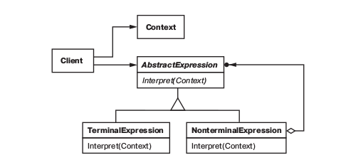
#### Применимость
* грамматика проста. Для сложных грамматик иерархия классов становится слишком громоздкой и неуправляемой.
  В таких случаях лучше применять генераторы синтаксических анализаторов, поскольку они могут интерпретировать выражения,
  не строя абстрактных синтаксических деревьев, что экономит память, а возможно, и время;  
* эффективность не является главным критерием. Наиболее эффективные интерпретаторы обычно не работают непосредственно с деревьями,
  а сначала транслируют их в другую форму. Так, регулярное выражение часто преобразуют в конечный автомат.
  Но даже в этом случае сам транслятор можно реализовать с помощью паттерна интерпретатор.
   
### <a name="it">_Iterator(Итератор)_</a>
#### Назначение
Предоставляет способ последовательного доступа ко всем элементам составного объекта, не раскрывая его внутреннего представления.
#### Структура
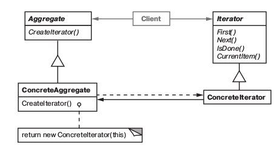
#### Применимость
* для доступа к содержимому агрегированных объектов без раскрытия их внутреннего представления;
* для поддержки нескольких активных обходов одного и того же агрегированного объекта;
* для предоставления единообразного интерфейса с целью обхода различных агрегированных структур   

### <a name="md">_Mediator(Посредник)_</a>
#### Назначение
Определяет объект, инкапсулирующий способ взаимодействия множества объектов. Посредник обеспечивает слабую связанность системы,
  избавляя объекты от необходимости явно ссылаться друг на друга и позволяя тем самым независимо изменять взаимодействия между ними.
#### Структура
    
#### Применимость
* имеются объекты, связи между которыми сложны и четко определены. Получающиеся при этом взаимозависимости не структурированы и трудны для понимания;
* нельзя повторно использовать объект, поскольку он обменивается информацией со многими другими объектами;
* поведение, распределенное между несколькими классами, должно поддаваться настройке без порождения множества подклассов.

### <a name="mem">_Memento(Хранитель)_</a>
#### Назначение
Не нарушая инкапсуляции, фиксирует и выносит за пределы объекта его внутреннее состояние так, чтобы позднее можно было восстановить в нем объект.
#### Структура
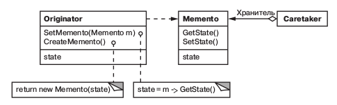 
#### Применимость
* необходимо сохранить мгновенный снимок состояния объекта (или его части),чтобы впоследствии объект можно было восстановить в том же состоянии;
* прямое получение этого состояния раскрывает детали реализации и нарушает инкапсуляцию объекта.

### <a name="obs">_Observer(Наблюдатель)_</a>
#### Назначение
Определяет зависимость типа «один ко многим» между объектами таким образом, что при изменении состояния одного объекта
  все зависящие от него оповещаются об этом и автоматически обновляются.
#### Структура
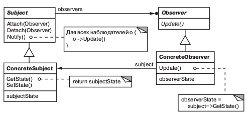
#### Применимость
* когда у абстракции есть два аспекта, один из которых зависит от другого.Инкапсуляции этих аспектов в разные объекты
  позволяют изменять и повторно использовать их независимо;
* когда при модификации одного объекта требуется изменить другие и вы не знаете, сколько именно объектов нужно изменить;   
* когда один объект должен оповещать других, не делая предположений об уведомляемых объектах.
  Другими словами, вы не хотите, чтобы объекты были тесно связаны между собой.
    
### <a name="st">_State(Состояние)_</a>
#### Назначение
Позволяет объекту варьировать свое поведение в зависимости от внутреннего состояния. Извне создается впечатление, что изменился класс объекта.
#### Структура
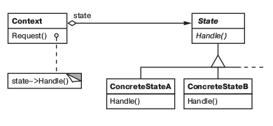
#### Применимость
* когда поведение объекта зависит от его состояния и должно изменяться во время выполнения;
* когда в коде операций встречаются состоящие из многих ветвей условные операторы, в которых выбор ветви зависит от состояния.
  Обычно в таком случае состояние представлено перечисляемыми константами. Часто одна и та же структура условного оператора
  повторяется в нескольких операциях. Паттерн состояние предлагает поместить каждую ветвь в отдельный класс.
  Это позволяет трактовать состояние объекта как самостоятельный объект, который может изменяться независимо от других.
      
### <a name="str">_Strategy(Стратегия)_</a>
#### Назначение
Определяет семейство алгоритмов, инкапсулирует каждый из них и делает их взаимозаменяемыми.
  Стратегия позволяет изменять алгоритмы независимо от клиентов, которые ими пользуются.
#### Структура
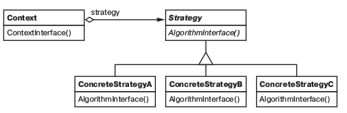
#### Применимость
* имеется много родственных классов, отличающихся только поведением. Стратегия позволяет сконфигурировать класс, задав одно из возможных поведений;
* вам нужно иметь несколько разных вариантов алгоритма. Например, можно определить два варианта алгоритма, один из которых требует больше
  времени, а другой – больше памяти. Стратегии разрешается применять, когда варианты алгоритмов реализованы в виде иерархии классов
* в алгоритме содержатся данные, о которых клиент не должен «знать». Используйте паттерн стратегия, чтобы не раскрывать сложные,
  специфичные для алгоритма структуры данных;
* в классе определено много поведений, что представлено разветвленными условными операторами. В этом случае проще перенести
  код из ветвей в отдельные классы стратегий.
           
### <a name="tm">_Template Method(Шаблонный метод)_</a>
#### Назначение
Шаблонный метод определяет основу алгоритма и позволяет подклассам переопределить некоторые шаги алгоритма, не изменяя его структуру в целом.
#### Структура
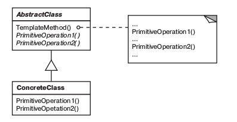
#### Применимость
* чтобы однократно использовать инвариантные части алгоритма, оставляя реализацию изменяющегося поведения на усмотрение подклассов;
* когда нужно вычленить и локализовать в одном классе поведение, общее для всех подклассов, дабы избежать дублирования кода.
  Это хороший пример техники «вынесения за скобки с целью обобщения», описанной в работе Уильяма Опдайка (William Opdyke) и Ральфа Джонсона (Ralph Johnson).
  Сначала идентифицируются различия в существующем коде, а затем они выносятся в отдельные операции.
  В конечном итоге различающиеся фрагменты кода заменяются шаблонным методом, из которого вызываются новые операции;
* для управления расширениями подклассов. Можно определить шаблонный метод так, что он будет вызывать операции
  зацепки (hooks) – см. раздел «Результаты» – в определенных точках, разрешив тем самым расширение только в этих точках.
        
### <a name="vs">_Visitor(Посетитель)_</a>
#### Назначение
Описывает операцию, выполняемую с каждым объектом из некоторой структуры. Паттерн посетитель позволяет определить новую операцию, не изменяя
  классы этих объектов.
#### Структура
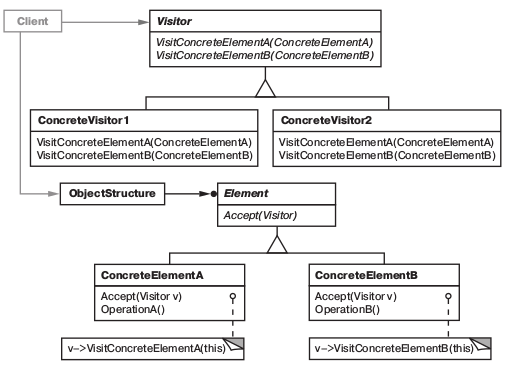
#### Применимость
* в структуре присутствуют объекты многих классов с различными интерфейсами и вы хотите выполнять над ними операции, зависящие от конкретных классов;
* над объектами, входящими в состав структуры, надо выполнять разнообразные, не связанные между собой операции и вы не хотите «засорять» классы
  такими операциями. Посетитель позволяет объединить родственные операции, поместив их в один класс. Если структура объектов является общей для
  нескольких приложений, то паттерн посетитель позволит в каждое приложение включить только относящиеся к нему операции;
* классы, устанавливающие структуру объектов, изменяются редко, но новые операции над этой структурой добавляются часто.
  При изменении классов, представленных в структуре, нужно будет переопределить интерфейсы всех посетителей,
  а это может вызвать затруднения. Поэтому если классы меняют ся достаточно часто, то, вероятно, лучше определить операции прямо в них.          
  
  
  
  
  
  